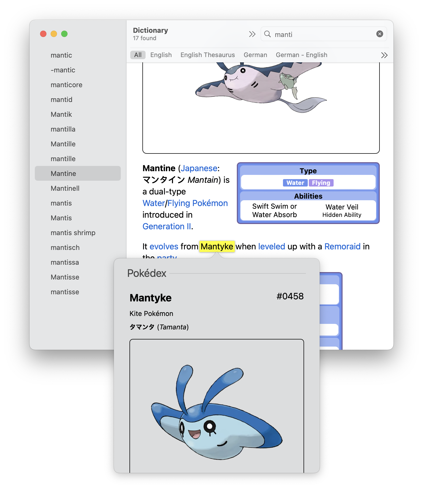

# Pokédex for Dictionary.app
Adds all Pokémon to the macOS Dictionary, for use in Look Up.

Data is loaded from Bulbapedia.

## Building
1. Use macOS
2. Clone the repository
3. Install [Rust](https://rust-lang.org)
4. In the repository directory,
    - run `./make.sh --hq` for high-quality images. this will take longer and use 1–2 GB cache space
    - run `./make.sh` otherwise
5. Copy `ddk/objects/Pokédex.dictionary` to `~/Library/Dictionaries`
6. Open Dictionary.app and enable “Pokédex” in Preferences
